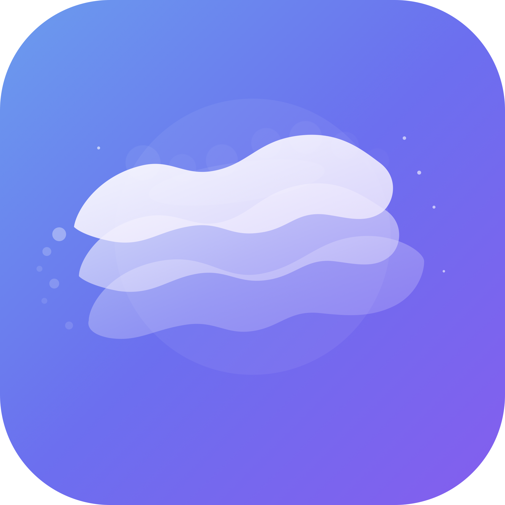

<p align="center">
  
</p>

<h1 align="center">SwiftMotion</h1>

<p align="center">
  <strong>58 reasons your SwiftUI app feels dead.</strong>
</p>

<p align="center">
  57 animations &bull; 4 games &bull; 30 Metal shaders &bull; 5 welcome screens<br/>
  One Xcode project. Zero dependencies.
</p>

<p align="center">
  <a href="#text-animations">Text</a> &bull;
  <a href="#image-effects">Image</a> &bull;
  <a href="#button-animations">Buttons</a> &bull;
  <a href="#games">Games</a> &bull;
  <a href="#welcome-screens">Welcome Screens</a> &bull;
  <a href="#metal-shaders">Shaders</a>
</p>

---

## What is this?

SwiftMotion is a curated collection of **production-ready SwiftUI animations** — every technique I know, in one Xcode project you can clone, run, and copy from.

Every animation is a **self-contained SwiftUI view**. No wrappers. No abstractions. No packages. Just the code that makes it work.

```
git clone https://github.com/ajagatobby/SwiftMotion.git
```

Open in Xcode. Hit Run. That's it.

---

## Text Animations

15 GPU-accelerated text effects built with Metal shaders and SwiftUI.

| Animation | Technique |
|-----------|-----------|
| **Liquid** | Metal shader with FBM noise, layered sine waves |
| **Stretchy** | DisplayLink + Metal distortion shader |
| **Wave** | 4-layer sine wave displacement |
| **Glitch** | RGB split, horizontal slice displacement, scanlines |
| **Magnet** | Pixel attraction toward touch point |
| **Vortex** | Rotation around center with distance falloff |
| **Typewriter** | Character-by-character reveal with blinking cursor |
| **Scramble** | Random characters resolve into target text |
| **Split Shatter** | Characters explode with random offsets and rotations |
| **Kinetic** | Per-character sine wave bounce |
| **Flip Reveal** | 3D character flip on X-axis |
| **Morphing** | Word transition with numericText content transition |
| **Burn Dissolve** | Drag-to-paint burn effect with Metal |
| **Pixel Sort** | Luminance-based horizontal pixel displacement |
| **Chrome** | Metallic reflection responding to device tilt |

---

## Image Effects

13 image animations using Metal shaders and SwiftUI gestures.

| Effect | Technique |
|--------|-----------|
| **Liquid** | Organic flowing displacement with touch interaction |
| **Chromatic** | RGB channel separation on drag |
| **Parallax** | Multi-layer depth effect with device motion |
| **Noise Dissolve** | Threshold-based particle dissolve |
| **Card Flip** | 3D Y-axis rotation with front/back faces |
| **Morph** | Drag-to-deform distortion shader |
| **Frozen** | Ice/frost distortion effect |
| **Halftone** | Dot-based print effect |
| **Duotone** | Two-color grading |
| **Scratch Reveal** | Drag to reveal image underneath |
| **Water Reflection** | Water ripple distortion |
| **Zoom Lens** | Magnification following finger position |
| **Before/After** | Slider-based comparison |

---

## Button Animations

6 interactive button styles with physics and haptics.

| Button | Style |
|--------|-------|
| **Duolingo 3D** | Raised button that presses into shadow |
| **Jelly** | Blob deformation on press |
| **Magnetic** | Magnetic attraction with drag physics |
| **Liquid Fill** | Hold-to-fill progress with gradient |
| **Neon Glow** | Pulsing neon shadow on hold |
| **Elastic Pill** | Bouncy spring with icon |

---

## Games

4 playable games built entirely in SwiftUI.

| Game | Description |
|------|-------------|
| **Neon Snake** | Classic snake with neon aesthetic |
| **Magic Tiles** | Piano/rhythm tile tapper |
| **Color Tap** | Color matching reaction game |
| **Dither Dash** | Dithering effect runner |

---

## Welcome Screens

5 complete onboarding flows with sequential animations, haptics, and micro-interactions.

| Screen | Highlights |
|--------|------------|
| **FoodPal V1** | Metal shader background, scramble text, floating emoji particles, haptic-driven sequence |
| **FoodPal V2** | Cream editorial style, animated calorie ring, 3-slide carousel with auto-advance, skeleton shimmer |
| **Book Genre Picker** | Stamp-shaped cards with scalloped edges, fan carousel, page-flip logo animation |
| **Glimpse** | Marquee card carousel, auto-animating magnet shader on title text, staggered card heights |
| **Meditation** | Breathing circle with rotating rings, warp-speed star field, blinking kawaii mascot |

---

## Metal Shaders

30 custom `.metal` shader files for GPU-accelerated effects.

```
LiquidText.metal        StretchyText.metal      WaveText.metal
GlitchText.metal        ChromeText.metal        VortexText.metal
MagnetText.metal        PixelSortText.metal     BurnText.metal
LiquidImage.metal       ChromaticImage.metal    FrozenImage.metal
HalftoneImage.metal     DuotoneImage.metal      NoiseDissolve.metal
WaterReflection.metal   ParallaxImage.metal     MorphImage.metal
FoodPalBackground.metal ShimmerEffect.metal     WelcomeBackground.metal
BlackHole.metal         GlossySticker.metal     PaperSheet.metal
PaperBurn.metal         CoinFlip.metal          Dither.metal
DitherDash.metal        MagicTiles.metal        EarthShaders.metal
```

---

## Requirements

- iOS 17.0+
- Xcode 15.0+
- Swift 5.9+
- No external dependencies

---

## Getting Started

```bash
git clone https://github.com/ajagatobby/SwiftMotion.git
cd SwiftMotion
open Motion.xcodeproj
```

Hit **Run**. Browse the demo gallery. Find an animation you like. Copy the view file into your project.

---

## How to Use

Each animation is a standalone SwiftUI view. To use any animation in your project:

1. Copy the `.swift` file (e.g., `LiquidTextView.swift`)
2. Copy the corresponding `.metal` shader file if it uses one
3. Add both to your Xcode project
4. Use the view: `LiquidTextView()`

That's it. No setup. No configuration.

---

## Hire Me

I'm a solo iOS developer who obsesses over animation details. If you want your app to feel this alive, I'm available for freelance work.

**[Twitter/X](https://twitter.com/AjagatO)** &bull; **[GitHub](https://github.com/ajagatobby)**

---

## License

MIT License. Use it however you want. See [LICENSE](LICENSE) for details.

---

<p align="center">
  <sub>Built with SwiftUI + Metal. No dependencies. Just vibes.</sub>
</p>
